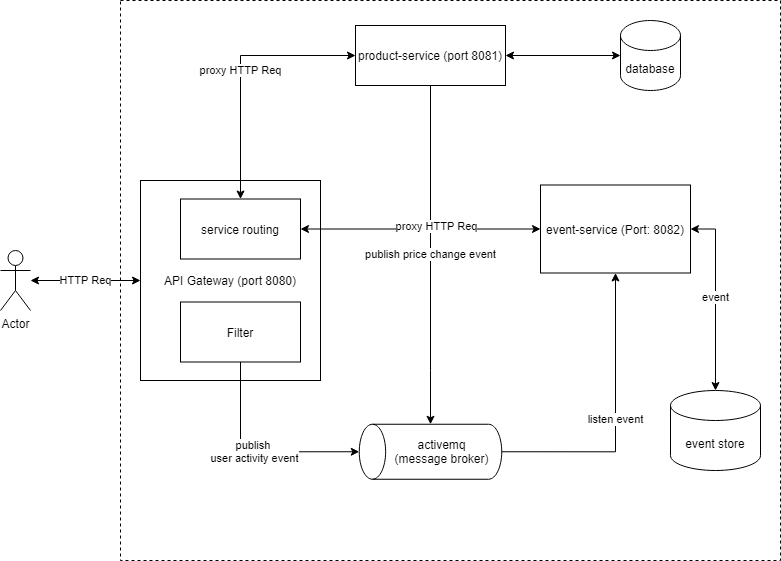

Folder Structure And Libraries
================

```
iCommerce
└── eureka-server
    |__spring-netflix-eureka-server
└── event-store
    |__spring-activemq
    |__spring-data-elasticsearch
└── gateway
    |__spring-gateway
└── product-service
└── README.md
```

Architacture
================
#### Event Sourcing
Event sourcing pattern helps us records all changes in product entity and HTTP request as events. It will send asynchronous message to broker so it doesn't interrupt the main flow of application.



How To Run On Local
================
### Setup ActiveMQ
###### Download latest version [here](https://activemq.apache.org/components/artemis/download/)
###### Creating a Broker Instance
```bash
${ARTEMIS_HOME}/bin/artemis create mybroker
```
###### Start server
```bash
${ARTEMIS_HOME}/mybroker/bin/artemis run
```

### Setup Elasticsearch
###### Download latest version and extract archive file [Linux](https://artifacts.elastic.co/downloads/elasticsearch/elasticsearch-7.12.1-linux-x86_64.tar.gz), [Mac](https://artifacts.elastic.co/downloads/elasticsearch/elasticsearch-7.12.1-darwin-x86_64.tar.gz), [Windows](https://artifacts.elastic.co/downloads/elasticsearch/elasticsearch-7.12.1-windows-x86_64.zip)
###### Running Elasticsearch from the command line
```bash
./bin/elasticsearch
```
### Run Services
1. eureka-server
```
cd ./eureka-server
mvn springboot:run
```
2. event-store
```
cd ./event-store
mvn springboot:run
```
3. gateway
```
cd ./gateway
mvn springboot:run
```
4. product-service
```
cd ./product-service
mvn springboot:run
```


CURL Testing
================
* To pass the values that you want to save, use option -d of curl. Try to write the curl command by your self. The solution is just few lines below:

```bash
curl -i -X GET http://localhost:8080/products
```

```bash
curl -i -X GET http://localhost:8080/products/1
```

```bash
curl -i -X POST http://localhost:8080/products/update-prices -d '[{"productId":1, "price": 9999}, {"productId":2, "price": 1234]'
```

```bash
curl -i -X GET http://localhost:8080/audit/user-activities?page=0&size=10
```

```bash
curl -i -X GET http://localhost:8080/audit/price-history?page=0&size=10&id=1
```
